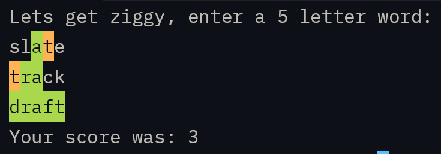

# Ziggle

My first zig project. Play wordle in your terminal.



## Install & Run

```
curl -L https://github.com/tylerthecoder/zig-wordle/releases/download/main/zigle -o ziggle
chmod +x ./ziggle
./ziggle
```

## Dev
Build
```
zig build
```

Run
```
zig build run
```

Test
```
zig build test
```
